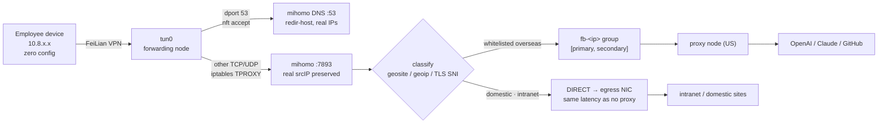
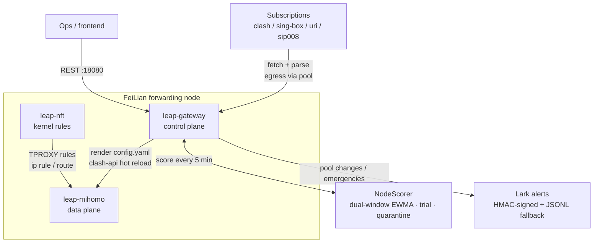

<div align="center">

# Interchange · 立交网关

**Reach your corporate intranet and the global internet at the same time,
on a FeiLian forwarding node — with zero client-side configuration.**

[](go.mod)
[](LICENSE)
[](https://github.com/MetaCubeX/mihomo)

[中文](README.md) · English


</div>

---

## Why this exists

Once AI tools became part of everyday development, a contradiction turned
into a daily annoyance:

**Employees need the intranet and the outside internet at the same time.**
Claude, ChatGPT, Copilot, Cursor, GitHub, npm, PyPI — these are no longer
"browsing blocked sites", they are prerequisites for writing code. Meanwhile
the company's GitLab, Jira and internal APIs still live on the intranet.

Traditionally the two are mutually exclusive:

- On the corporate VPN, you can't get out.
- On a personal proxy, you can't get in.
- With both running, routing tables fight, and people toggle all day.

So workarounds appear: everyone buys their own subscription, installs a
client, and trades routing rules in a group chat. IT has no visibility, no
control, and the cost is scattered across dozens of personal invoices.

**Interchange folds both paths onto infrastructure the company already
owns: a FeiLian (Volcano Engine CorpLink) forwarding node.** Employees
connect to FeiLian exactly as before — nothing to install, nothing to
configure. Domestic traffic goes out directly; whitelisted overseas traffic
is transparently steered through subscription proxy nodes on the node
itself.

The name means "highway interchange": two lanes meeting at one node,
crossing on separate levels, never interfering.

## What it does


- **Nothing changes for employees** — no client, no proxy settings, no rule
  files. FeiLian is already installed.
- **Zero overhead for domestic traffic** — `geosite-cn` / `geoip-cn` match
  first; on a hit the packet goes out directly, with the same latency as no
  proxy at all, and it consumes no subscription bandwidth.
- **The intranet stays reachable** — internal domains resolve via domestic
  DoH and egress directly, unaffected by the proxy path.
- **One terminal, one egress** — every overseas request from a device exits
  through the same node, so multiple egress IPs never trip Cloudflare's or
  OpenAI's anomaly detection.
- **The node picks its own routes** — all candidates are scored every 5
  minutes; slow or failing ones are evicted; a dead node fails over within
  30 seconds; pool changes are pushed to Lark.
- **Programmable** — 25 REST endpoints covering subscriptions, whitelist,
  pool membership and notifications, plus a build-free web console for
  subscription management and live node status.

## How it compares

| Approach | Monthly cost | Employee burden | Notes |
|---|---|---|---|
| **Interchange + proxy subscription** | roughly ¥100–500, up to ~¥1000 | none | reuses the existing FeiLian node |
| Commercial SD-WAN / dedicated line | ¥1000+ | usually a vendor client too | solid, but heavy for this purpose |
| Self-hosted overseas VPS | ¥1000+ | per-person setup | you also own the performance and stability problems |
| Employees buying their own | scattered personal invoices | everyone fends for themselves | invisible and unmanageable for IT |

**The scope is deliberately narrow**: US nodes only
(`url_test.node_pattern` defaults to `'美国|🇺🇸|\bUS'`), whitelisted sites
only. Giving up "any landing point worldwide, all traffic proxied" buys
lower cost, a smaller failure surface, and lighter operations.

**Measured capacity** (single node, 2026-06-07, see the `capacity:` block):

| Metric | Value |
|---|---|
| Sustained | 50 users (p95 ≈ 2s) |
| Degraded | 150 users (p95 ≈ 5s, ~0 errors) |
| Bottleneck | cross-border subscription bandwidth, not the local data plane |

mihomo CPU stayed below 36% even at 150 concurrent. Load-test workers push
roughly 5–10× a real employee's request rate, so the real ceiling is well
above these conservative floors. Re-run `scripts/stress.sh` on your own
node and overwrite both numbers.

## Architecture

Three systemd units with non-overlapping responsibilities:

| Unit | Role | Responsibility |
|---|---|---|
| `leap-gateway` | control plane (Go) | subscription fetch/parse, whitelist expansion, node scoring, mihomo config rendering, REST API, Lark alerts |
| `leap-mihomo` | data plane | DNS server, transparent proxy, traffic classification, subscription egress |
| `leap-nft` | kernel rules | nft rules, iptables TPROXY, ip rule/route |

### Data plane: the two fates of a packet



### Control plane: who drives what



## Prerequisites

On the node (each one is enforced by `precheck()` in
`deploy/node/install.sh`):

- A **FeiLian forwarding node** with `feilian-tun@tun0.service` active
- root / sudo
- `tun0`'s IP matching `node.tun0_gateway_ip` in `gateway.yaml`
- `net.ipv4.conf.all.rp_filter` ∈ {0, 2} (fwmark policy routing needs loose mode)
- `net.ipv4.ip_forward = 1`
- `tun0_gateway_ip:53` and the API port (18080 by default) free
- Kernel support for `xt_TPROXY`

For development:

- Go 1.22+, `make`
- At least one proxy subscription (clash YAML, sing-box JSON, URI list, or SIP008)

The installer places mihomo 1.19.26 as the data plane. It also installs a
sing-box 1.10.7 binary that **does not run as a service** — mihomo has no
equivalent command, so whitelist expansion shells out to
`sing-box rule-set decompile`.

## Deployment

```bash
git clone https://github.com/czgreg/interchange.git
cd interchange
cp configs/gateway.example.yaml gateway.yaml
```

Edit `gateway.yaml`. The minimum set:

```yaml
subscriptions:
  - name: "main"
    url: "https://your-provider/subscription-url"
    format: "auto"          # auto | clash | singbox | uri | sip008
    enabled: true

node:                       # FeiLian-assigned; no defaults possible
  client_subnet:   "10.8.11.0/24"   # FeiLian client pool CIDR on this node
  tun0_gateway_ip: "10.8.11.1"      # gateway IP on tun0; mihomo DNS binds here
  egress_iface:    "ens18"          # public egress NIC

data_plane:
  tproxy_port: 7893         # required, > 0 — TPROXY is the only supported path
```

Set up SSH once, then deploy:

```bash
make setup-ssh NODE=<user>@<node-ip>   # push key + NOPASSWD sudo, one time
make redeploy-full NODE=<user>@<node-ip>
```

`redeploy-full` **pulls the node's yaml first** and stages from that, so a
stale local config can never clobber the node. On a first-ever install
there is no yaml on the node yet — use
`make deploy-full-LOCAL-YAML NODE=...` to push your local one.

After that, binary-only swaps take about 10 seconds:

```bash
make deploy-fast NODE=<user>@<node-ip>
```

`deploy-89` / `deploy-92` / `redeploy-89` / `redeploy-92` in the `Makefile`
are shortcuts for the author's staging and production nodes. Both `NODE`
and `REMOTE_USER` can be overridden.

Configure Lark alerts (optional; the secret never lands in yaml):

```bash
curl -X POST -H "Content-Type: application/json" \
  -d '{"webhook_url":"https://open.feishu.cn/open-apis/bot/v2/hook/xxx",
       "secret":"<bot-secret>","signature_required":true}' \
  http://<node-ip>:18080/api/notifications/lark
```

## Web console

The control plane serves a web UI — no build step, no separate deploy:

```
http://<node-ip>:18080/ui/
```

Five panels:

| Panel | Purpose |
|---|---|
| **Overview** | data-plane health, pool size, the three systemd units, egress IP, capacity baseline |
| **Nodes** | per-candidate p50/p95/jitter/fail-rate, pool membership, site-probe results (filterable, pool-only toggle) |
| **Subscriptions** | add / edit / delete subscriptions, manual fetch, periodic-refresh interval |
| **Terminal lookup** | enter an employee's 10.8.x.x and see their primary/secondary egress with health data |
| **Pool audit** | membership-change history and the current quarantine list |

It is a dependency-free page embedded with `go:embed`, so deployment stays
"ship one binary" — no Node, no separate asset directory to keep in sync.

A few deliberate security choices:

- **`/ui/` is unauthenticated, but it is only static files.** The page
  contains no node data and no credentials; everything real comes from
  `/api/*`, which stays behind `api.token`. A browser navigation cannot
  carry a Bearer header, so gating the HTML itself would push the token
  into a URL or cookie — strictly worse.
- **The token lives in tab memory only**, never `localStorage`. Reloading
  asks again, on purpose: that token can read subscription URLs with
  credentials in them.
- **Reachability is governed by `api.listen` and the nft rules.** The
  default `127.0.0.1:18080` means you port-forward; `0.0.0.0` allows remote
  access, while the FeiLian client subnet stays unconditionally denied.
  Serving the UI does not widen that surface.

```bash
# With api.listen left at its loopback default, forward the port:
ssh -L 18080:127.0.0.1:18080 <user>@<node-ip>
# then open http://127.0.0.1:18080/ui/
```

> Subscription writes and "fetch now" both reload mihomo (~3–5s
> interruption), so the UI confirms first. Also, `GET /api/subscriptions`
> returns masked URLs (`token=c85b***0f02`), so editing never prefills the
> old URL — changing one requires pasting a complete new URL, and a masked
> value is rejected client-side before it can reach the node.

## Day-to-day operations

```bash
make status         # /api/status — engine / pool / capacity / 24h stability
make nodes          # /api/nodes/health — scores + probes + passive stats
make health         # /api/proxies/active — live data-plane snapshot
make logs           # leap-gateway logs
make mihomo-logs    # data-plane logs
make nft            # inspect nft table inet leap
make ssh            # shell into the node
```

When `api.token` is set, pass `LEAP_TOKEN=<token>` to `make`. Full endpoint
reference: [docs/api.md](docs/api.md).

> **⛔ One hard rule: never sync `subscriptions:` across nodes.**
> Each node's subscription list is operator-owned and deliberately
> different — geography, contract terms, cost. Treating it as "config drift
> to normalize" silently breaks production; this rule was written after it
> actually happened. `make redeploy-*` uses the yaml-first path and is safe
> by construction. See [CLAUDE.md](CLAUDE.md).

## How it works

### TPROXY, not TUN

`xt_TPROXY` intercepts non-DNS traffic from `tun0` at mangle PREROUTING and
hands it to mihomo:7893, **preserving the real client IP** (10.8.x.x).

This is a hard prerequisite for "one terminal, one egress". Both TUN stacks
(`system` and `gvisor`) collapse every client to `198.18.0.0`, which
degenerates per-terminal routing into everyone sharing one egress.
`tun.stack` only affects CPU, never the source IP.

### `redir-host`, not fake-IP

mihomo owns DNS and returns **real IPs** for every domain, with no blanket
hijacking. Routing does not depend on the DNS answer — the sniffer extracts
the domain from TLS SNI / HTTP Host / QUIC (covering pure-IP flows too) and
`geosite` rules classify on that. CN domains resolve via domestic DoH;
overseas domains via proxy DoH that egresses through the pool, bypassing
GFW's UDP 53 race answers.

**Why fake-IP was dropped**: fake-IP is a "hijack by default, exempt by
list" model, so any domain missing from the list gets a `198.18.x.x`
address and then times out. On 2026-07-06 a provider switch left the new
provider's own server domain unconfigured, and every node reported
`alive=false` — the entire pool looked dead. `redir-host` eliminates that
whole failure class at the root: node hostnames and intranet domains get
real IPs automatically, with zero maintenance.

### `fb-<ip>`: one terminal, one egress

With `load_balance.per_terminal` enabled, every client IP gets a dedicated
`fallback` group in the mihomo config named `fb-<ip>`, holding the HRW top-2
as `[primary, secondary]`. A `SRC-IP-CIDR` rule steers that IP's traffic
into the group.

- Primary alive → always primary, so the egress IP stays stable.
- Primary dead → mihomo's built-in alive bit switches to secondary within
  30 seconds, **with no control-plane involvement**.
- All destinations for one terminal share one egress — ChatGPT's
  `chatgpt.com` / `chat.openai.com` / `cdn.openai.com` all exit from the
  same IP, so fan-out detection never fires.

### NodeScorer: slow decisions, damped

The split of responsibility is deliberate:

| Layer | Cycle | Decides |
|---|---|---|
| mihomo `health_check_interval` | 30s | binary liveness; dead nodes skipped per-flow, no re-render |
| `node_qualify.scoring_interval` | 5m | graded quality; only persistent degradation triggers a reload |

The score is `p95 + 2×jitter + 5000×fail²`, ranked on a long-window EWMA
with a 24h half-life. Three damping layers: new nodes cannot be promoted
during a 24h trial; rolled-back nodes are quarantined for an hour by
default; and swapping a non-member in requires an absolute score margin
above `swap_threshold_score` (default **400**). `fail_rate ≥ 0.9` is a
catastrophic gate — instantly unqualified, naturally evicted within 10
minutes.

That 400 was tuned, not guessed: the original 100 ("100ms better p95")
measured ~67 pool swaps per 24h on a 22-node candidate set, and the
resulting IP drift is exactly what CF/OpenAI behavioral models look for.
Set it to 0 to get back "any improvement triggers a swap" semantics.

Site probes deliberately target endpoints that reflect **egress IP
reputation** rather than pages that JS-challenge a headless client. A 401
from `api.openai.com/v1/models` means the request genuinely reached
OpenAI's API plane and the egress IP was accepted. A Cloudflare challenge
is always scored as a failure — the request never reached the origin, so it
cannot count as reachable.

## Design decisions and things that went wrong

This section carries more information than the mechanisms above, because
it describes what they look like **after** being corrected.

### "A fixed pool of K members" was the wrong abstraction

The original design held the pool at a fixed size K derived from a capacity
formula, `⌈T_active × surge / cap_per_node⌉`. In production that produced
roughly 50 pool-membership changes per day; of 49 transitions, 15 were pure
period-2 reversals.

Five independent analyses, each starting from first principles, converged
on the same conclusion: **the problem was not the parameters, it was the
abstraction.**

- All three inputs to K were unmeasured (`t_active=50` versus 19 observed;
  `cap_per_node=10` never tested).
- Forcing a fixed size is a **comparator-driven saturating actuator with no
  deadband** — the system limit-cycled on the actuator's own period, which
  happened to be exactly 300s.
- Signal-to-noise was 0.02–0.05: real tier differences of 25–80 against
  composite noise of 1400–4500. At 15–45× below the noise floor,
  `swap_threshold=100` was not a threshold at all.
- K's only real effect was "which set HRW draws from". It was never a
  capacity reservation or a load-balancing mechanism — HRW does the
  balancing, and measurements showed at most 6 terminals per node against a
  cap of 10.

The fix was to delete the fixed size: HRW draws directly from the set of
all qualifying nodes, so the contended marginal slot stops existing by
construction, and the ping-pong goes with it. It is also better for
detection avoidance — a fixed-K swap moves 24% of terminals' egress
(because it forces a removal and an addition together), while the
eligibility-set approach only pays whichever half actually happened.

Full reasoning:
[docs/design-eligibility-set-selection.md](docs/design-eligibility-set-selection.md).
The two rejected predecessors:
[docs/design-pool-sizing-rejected-v1v2.md](docs/design-pool-sizing-rejected-v1v2.md).
`sizing_mode` still defaults to `legacy`; set `sizing_shadow: true` to run
the new selection in parallel for 24h and diff the decisions before cutting
over.

### Discovered User-Agents are never written back to yaml

Providers react differently to the User-Agent: some return HTTP 500 for a
sing-box UA, others return a stripped `proxies: []` for a Clash UA. So
there is an auto-discovery path that tries the other UA family when a
subscription returns 5xx or zero nodes.

An early version persisted the discovered UA back into yaml — and caused an
incident: **a transient error on the working UA flipped the config
permanently to a broken one, with no path to self-heal.** Discovery now
only rescues the current refresh round and logs a line for the operator to
decide. `subscriptions[]` is operator-owned; the program does not edit it.

### Racing DoH upstreams lets NXDOMAIN win

mihomo races multiple `proxy-server-nameserver` upstreams **in parallel and
takes the first non-error answer** — and NXDOMAIN does not count as an
error on that path (only SERVFAIL / REFUSED do). So when a DoH frontend
intermittently returns NXDOMAIN for a live domain, **adding a healthy
upstream does not help**: the fastest NXDOMAIN always wins. Measured on the
node: 10 dials, 10 failures.

The fix is `node_resolver_suffixes` — pin only the confirmed-broken suffix
to a plain UDP upstream; 10 dials, 0 failures. Why it must be
suffix-scoped: the plain UDP upstream (0.04–0.06s) is 4–5× faster than DoH
(0.164–0.291s), so adding it to the shared race would silently make it the
de facto primary resolver for **every** node hostname, moving all node
resolution onto a poisonable path.

### Other

- **A hot reload clears url-test history**, so live nodes briefly get the
  benefit of the doubt and enter the pool; genuinely dead ones drop out once
  history rebuilds. A known transient, bounded by the trial period and pool-set
  restoration. See [docs/ops-eligibility-cutover-92.md](docs/ops-eligibility-cutover-92.md).
- **`hot_reload_min_interval` defaults to 90s**: without throttling, every
  pool change would hot-reload and cut ChatGPT's long-lived SSE connections.
- **`subscribe.refresh_interval` defaults to 0 (off)**: burn-after-reading
  subscriptions break on a second fetch, node lists change infrequently
  anyway, and node health is already tracked by probes — re-fetching the
  subscription "to refresh things" is not a health mechanism.
- **`api.listen` defaults to `127.0.0.1:18080`**: switch to `0.0.0.0` only
  if you need remote access. The node firewall unconditionally denies the
  FeiLian client subnet from reaching the API (otherwise VPN users could
  read subscription URLs, tokens included), but **production should still
  set `api.token`** — a network-layer control is not a substitute for
  application-layer auth.

## Repository layout

```
cmd/
  gateway/          control-plane entrypoint
  selftest/         offline subscription-fetch + render verification CLI
  render-mihomo/    mihomo config render CLI (debugging)
internal/
  api/              REST API (25 endpoints)
  config/           config schema, defaults, validation
  configstore/      atomic yaml read/write
  dataplane/        mihomo process control (systemctl / clash-api / assertions)
  dnspreload/       warms the DNS cache for frequently used domains
  leaphttp/         HTTP client (proxy first, then direct)
  mihomo/           config renderer (DNS / TPROXY / rules / groups / per-terminal)
  nodeinfo/         node self-information and probes
  nodescorer/       scoring, EWMA, pool decisions, transition audit, rollback, emergency eviction
  notify/           Lark webhook, dedup/rate-limit/aggregation, JSONL fallback
  rulesets/         geosite / geoip rule-set management
  subscribe/        subscription fetch and parsing (4 formats)
  whitelistexpand/  expands the whitelist into domains + CIDRs
deploy/node/        systemd units, nft template, iproute.sh, install.sh
scripts/
  deploy.sh         build + push + validate + restart
  redeploy-full.sh  yaml-first full reinstall
  stage.sh          build the full deployment tarball
  stress.sh         single-node capacity test
  setup-ssh.sh      one-time SSH key + NOPASSWD sudo
docs/
  api.md            REST API reference (with frontend integration changelog)
  design-*.md       design reasoning and rejected approaches
  ops-*.md          living production-observation documents
```

## Documentation

| Document | Contents |
|---|---|
| [configs/gateway.example.yaml](configs/gateway.example.yaml) | **The configuration reference.** 329 annotated lines; every non-obvious default explains itself |
| [docs/api.md](docs/api.md) | 25 REST endpoints + frontend integration changelog |
| [docs/design-eligibility-set-selection.md](docs/design-eligibility-set-selection.md) | Full reasoning behind eligibility-set selection |
| [docs/design-pool-sizing-rejected-v1v2.md](docs/design-pool-sizing-rejected-v1v2.md) | Two rejected pool-sizing designs and why |
| [docs/ops-eligibility-cutover-92.md](docs/ops-eligibility-cutover-92.md) | Living observation log for the production cutover |
| [CLAUDE.md](CLAUDE.md) | Project conventions for AI assistants (includes the `subscriptions` hard rule) |

## Scope and non-goals

Stating what this does not do saves more time than listing what it does:

- **Not a general-purpose circumvention tool.** By default only whitelisted
  sites are steered; everything else goes direct. `route.mode` can be
  switched to `overseas` (all non-CN destinations through the pool), but
  that is not the design focus.
- **No traffic auditing, no content filtering, no user-behavior logging.**
  Only operational logs for node health and pool changes.
- **No client distribution.** Access is FeiLian's job; this project only
  splits traffic on the forwarding node.
- **No home-grown proxy protocol.** The data plane is mihomo and
  subscriptions use standard formats.
- **US nodes only** — see "the scope is deliberately narrow" above.
- **No TUN-only mode.** With `tproxy_port` unset or 0, both `validate` and
  `iproute.sh` refuse to start.

## About the name

The product is **Interchange · 立交网关**, but the on-disk identifiers are
still `leap-*`: `/etc/leap/`, `leap-gateway.service`,
`leap-mihomo.service`, `leap-nft.service`, the `LEAP_*` environment
variables, and the Go module path
`github.com/leap-gateway/leap-gateway`.

That is deliberate. Those names are already running on production nodes;
renaming them would mean a path migration in `install.sh` plus a full
reinstall, for zero benefit and non-trivial risk. A product name that
differs from its implementation identifiers is an acceptable piece of
history — forcing them to match would be the bad decision.

## License

[MIT](LICENSE)
