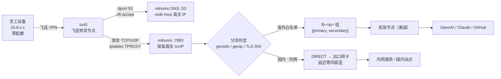
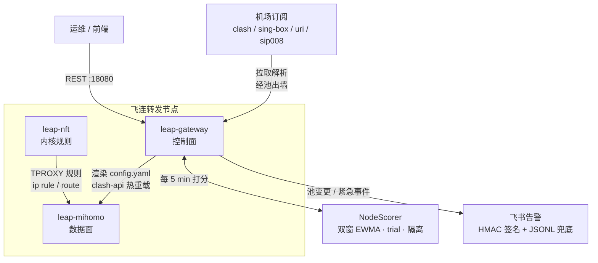

<div align="center">

# Interchange · 立交网关

**在飞连转发节点上，让内网和海外同时可达 —— 员工零配置、零客户端、零感知。**

[](go.mod)
[](LICENSE)
[](https://github.com/MetaCubeX/mihomo)

中文 · [English](README.en.md)


</div>

---

## 为什么有这个项目

AI 工具成了日常开发的一部分之后，一个矛盾突然变得很日常：

**员工既要连内网，又要访问海外。** Claude、ChatGPT、Copilot、Cursor、
GitHub、npm、PyPI —— 这些不再是"翻墙上网"，而是写代码的必要条件。同时
公司的 GitLab、Jira、内部 API 还在内网里。

传统做法里这两件事互斥：

- 挂着公司 VPN，出不去；
- 挂着个人代理，进不来内网；
- 两个都开，路由表打架，员工每天手动切来切去。

于是各种"变通"开始出现 —— 每人自费买机场、装客户端、在群里互相教怎么配
规则。IT 侧看不见、管不了，成本也散落在几十份个人账单里。

**Interchange 把这两条路合并到一个已有的基础设施上：飞连（火山引擎
CorpLink）的转发节点。** 员工照常连飞连，什么都不用装、不用配。去往国内的
流量原样直连，去往海外白名单的流量在节点上被透明分流到机场节点。

名字取"立交桥"之意：两条车道在同一个节点上交汇，分层通行、互不干扰。

## 它做什么


- **员工侧零改动** —— 不装客户端、不改代理设置、不配规则。飞连本来就装了。
- **国内流量零损耗** —— `geosite-cn` / `geoip-cn` 最前匹配，命中即直连，
  延迟与不开代理时一致，也不消耗机场流量。
- **内网照常可达** —— 内网域名走国内 DoH 解析、直连出站，不受代理影响。
- **一个终端一个出口** —— 同一台设备的所有海外请求走同一个机场节点，
  不会因为多个出口 IP 触发 Cloudflare / OpenAI 的风控。
- **节点自己会挑路** —— 每 5 分钟给所有候选节点打分，慢的、失败的自动
  剔出；节点挂了 30 秒内自动切备用；池组成变化推送飞书。
- **可编排** —— 25 个 REST 端点，订阅、白名单、池成员、告警都能程序化操作；
  自带一个免构建的 Web 控制台，订阅管理与节点状态直接在浏览器里看。

## 和其他方案的取舍

| 方案 | 月成本量级 | 员工侧负担 | 备注 |
|---|---|---|---|
| **Interchange + 机场订阅** | 约 100–500 元，上限约 1000 元 | 零 | 复用已有的飞连节点 |
| 商业 SD-WAN / 跨境专线 | 千元以上 | 通常还要装厂商客户端 | 稳定，但为这个用途偏重 |
| 自建海外 VPS | 千元以上 | 每人各自配置 | 还要自己扛性能损耗与稳定性 |
| 员工自费买机场 | 分散在个人账单 | 每人自己折腾 | IT 看不见、管不了 |

**范围是刻意收窄的**：只面向美国节点（`url_test.node_pattern` 默认
`'美国|🇺🇸|\bUS'`），只做白名单站点的分流。放弃"全球任意落地 + 全量流量
代理"，换来成本更低、故障面更小、运维更轻。

**实测容量**（单节点，2026-06-07，见 `capacity:` 配置块）：

| 指标 | 数值 |
|---|---|
| 稳定承载 | 50 人（p95 ≈ 2s） |
| 降级承载 | 150 人（p95 ≈ 5s，错误率 ≈ 0） |
| 瓶颈 | 跨境机场带宽，不是本地数据面 |

150 并发下 mihomo CPU 仍低于 36%。压测 worker 的请求率约等于真实员工的
5–10 倍，所以真实可承载人数明显高于这两个保守值。用 `scripts/stress.sh`
在你自己的节点上重测，然后覆盖这两个数字。

## 架构

三个 systemd 单元，职责不重叠：

| 单元 | 角色 | 职责 |
|---|---|---|
| `leap-gateway` | 控制面（Go） | 订阅拉取解析 / 白名单展开 / 节点打分 / 渲染 mihomo 配置 / REST API / 飞书告警 |
| `leap-mihomo` | 数据面 | DNS 服务 + 透明代理 + 流量分类 + 机场出站 |
| `leap-nft` | 内核规则 | nft 规则 + iptables TPROXY + ip rule/route |

### 数据面：一个包的两种命运



### 控制面：谁在管谁



## 前置条件

节点侧（`deploy/node/install.sh` 的 `precheck()` 会逐条卡）：

- 一个**飞连转发节点**，`feilian-tun@tun0.service` 处于 active
- root / sudo
- `tun0` 的 IP 与 `gateway.yaml` 里的 `node.tun0_gateway_ip` 一致
- `net.ipv4.conf.all.rp_filter` ∈ {0, 2}（fwmark 策略路由需要 loose 模式）
- `net.ipv4.ip_forward = 1`
- `tun0_gateway_ip:53` 和 API 端口（默认 18080）空闲
- 内核支持 `xt_TPROXY`

开发侧：

- Go 1.22+、`make`
- 至少一个机场订阅（支持 clash YAML / sing-box JSON / URI 列表 / SIP008）

节点上会装 mihomo 1.19.26 作为数据面；另外还会装一个 sing-box 1.10.7
二进制，但它**不作为服务运行** —— 只是因为 mihomo 没有等价命令，白名单
展开时要 shell 出去调 `sing-box rule-set decompile`。

## 部署

```bash
git clone https://github.com/czgreg/interchange.git
cd interchange
cp configs/gateway.example.yaml gateway.yaml
```

编辑 `gateway.yaml`，最少要填这几项：

```yaml
subscriptions:
  - name: "main"
    url: "https://your-provider/subscription-url"
    format: "auto"          # auto | clash | singbox | uri | sip008
    enabled: true

node:                       # 飞连给这个转发节点分配的值，没有默认值
  client_subnet:   "10.8.11.0/24"   # 本节点飞连客户端地址池
  tun0_gateway_ip: "10.8.11.1"      # tun0 上的网关 IP，mihomo DNS 绑这里
  egress_iface:    "ens18"          # 公网出口网卡

data_plane:
  tproxy_port: 7893         # 必填且 > 0，TPROXY 是唯一支持的数据通路
```

然后一次性打通 SSH，再部署：

```bash
make setup-ssh NODE=<user>@<node-ip>   # 推公钥 + NOPASSWD sudo，只需一次
make redeploy-full NODE=<user>@<node-ip>
```

`redeploy-full` 是**先拉节点上的 yaml 再打包**，所以不会用本地的旧配置
覆盖节点。首次部署时节点上还没有 yaml，用
`make deploy-full-LOCAL-YAML NODE=...` 推本地的那份。

之后改代码只换二进制（约 10 秒）：

```bash
make deploy-fast NODE=<user>@<node-ip>
```

`Makefile` 里的 `deploy-92` / `redeploy-92` 是作者生产节点的快捷方式，
`NODE` 和 `REMOTE_USER` 都可以覆盖 —— 换成自己的节点用
`make deploy-fast NODE=dianwei@<ip>` 或 `make redeploy-full NODE=dianwei@<ip>`。

配置飞书告警（可选，secret 不落 yaml）：

```bash
curl -X POST -H "Content-Type: application/json" \
  -d '{"webhook_url":"https://open.feishu.cn/open-apis/bot/v2/hook/xxx",
       "secret":"<bot-secret>","signature_required":true}' \
  http://<node-ip>:18080/api/notifications/lark
```

## Web 控制台

控制面自带一个网页 UI，部署后直接访问：

```
http://<node-ip>:18080/ui/
```

五个面板：

| 面板 | 用途 |
|---|---|
| **总览** | 数据面是否正常、在池节点数、三个 systemd 单元状态、出口 IP、容量基准 |
| **节点状态** | 每个候选节点的 p50/p95/抖动/失败率、是否在池、各站点探针结果（可按名筛选、只看在池） |
| **订阅管理** | 新增 / 修改 / 删除订阅、手动拉取、调周期刷新间隔 |
| **终端查询** | 输入员工的 10.8.x.x，直接看到他的 primary / secondary 出口及其健康数据 |
| **池变更审计** | 池成员变更历史与当前隔离名单 |

它是一个无构建步骤、无依赖的页面，用 `go:embed` 编进二进制，所以部署仍然
是“推一个文件”，不需要 Node、不需要额外的静态目录。

关于安全，几个刻意的选择：

- **`/ui/` 不鉴权，但它只是静态文件** —— 页面本身不含任何节点数据或凭据，
  所有真实数据都走 `/api/*`，那些端点仍在 `api.token` 后面。浏览器导航
  无法带 Bearer 头，硬要给 HTML 鉴权只会把 token 逃到 URL 或 Cookie 里，
  反而更差。
- **token 只存在当前标签页内存**，不写 localStorage。刷新页面需要重新输入——
  这是有意的：token 能读到带凭据的订阅 URL。
- **可达范围由 `api.listen` 和 nft 规则控制**。默认 `127.0.0.1:18080` 意味着
  要用 SSH 端口转发；改成 `0.0.0.0` 才能远程访问，而飞连终端网段被 nft
  固定拒绕。开启 UI 不会扩大这个面。

```bash
# api.listen 保持默认（仅本机）时，用端口转发访问
ssh -L 18080:127.0.0.1:18080 <user>@<node-ip>
# 然后浏览器打开 http://127.0.0.1:18080/ui/
```

> 订阅的增删改与“立即拉取”都会重载 mihomo（约 3–5 秒中断），UI 会先弹确认。
> 另外 `GET /api/subscriptions` 返回的 URL 是脱敏的（`token=c85b***0f02`），
> 所以编辑时不会回填旧 URL；要改地址必须粘贴完整的新 URL，脱敏值会被前端拦下。

## 日常运维

```bash
make status         # /api/status —— 引擎 / 池 / 容量 / 24h 稳定度
make nodes          # /api/nodes/health —— 打分 + 探针 + 被动统计
make health         # /api/proxies/active —— 数据面活跃快照
make logs           # leap-gateway 日志
make mihomo-logs    # 数据面日志
make nft            # 查看 nft table inet leap
make ssh            # 直接登进节点
```

API 配了 `api.token` 时，给 `make` 传 `LEAP_TOKEN=<token>`。
完整端点见 [docs/api.md](docs/api.md)。

> **⛔ 一条硬规则：不要跨节点同步 `subscriptions:`。**
> 每个节点的订阅列表是运维自己拥有的，按地理位置、合同、成本刻意做得不
> 一样。把它当成"需要拉平的配置漂移"会静默搞坏生产 —— 这条规则是真踩过
> 才写下来的。`make redeploy-*` 走的是 yaml-first 路径，天然安全。
> 详见 [CLAUDE.md](CLAUDE.md)。

## 工作原理

### TPROXY，而不是 TUN

`xt_TPROXY` 在 mangle PREROUTING 拦下 `tun0` 上的非 DNS 流量交给
mihomo:7893，**保留真实客户端 IP**（10.8.x.x）。

这是"一个终端一个出口"的硬前提。两种 TUN stack（`system` 和 `gvisor`）
都会把所有客户端塌缩成 `198.18.0.0` —— 那样 per-terminal 路由退化成
所有人共用一个出口。`tun.stack` 只影响 CPU，不影响源 IP。

### `redir-host`，而不是 fake-IP

mihomo 接管 DNS，所有域名都返回**真实 IP**，不做全局劫持。路由不依赖
DNS 结果 —— sniffer 从 TLS SNI / HTTP Host / QUIC 里取域名（纯 IP 流量
也能覆盖），`geosite` 规则据此分类。CN 域名走国内 DoH，海外域名走经机场
出墙的 proxy DoH，绕开 GFW 的 UDP 53 抢答。

**为什么换掉 fake-IP**：fake-IP 是"默认劫持 + 名单豁免"模型，任何漏配的
域名都会拿到 `198.18.x.x` 假 IP 然后超时。2026-07-06 换订阅商时漏配了
新机场自己的服务器域名，结果全节点探测 `alive=false` —— 整个池看起来都
死了。`redir-host` 从根上消除这一类故障：节点域名和内网域名自动拿到真实
IP，零维护。

### `fb-<ip>`：一个终端，一个出口

开启 `load_balance.per_terminal` 后，每个客户端 IP 在 mihomo 配置里有一个
专属的 `fallback` 组，命名 `fb-<ip>`，成员是 HRW 算出的 top-2
`[primary, secondary]`。`SRC-IP-CIDR` 规则把这个 IP 的流量导到该组。

- 主节点活着 → 一直走 primary，出口 IP 稳定；
- 主节点死了 → mihomo 内置 alive 位在 30 秒内切到 secondary，**控制面
  不介入**；
- 一个终端的所有目的地共享同一出口 —— ChatGPT 的
  `chatgpt.com` / `chat.openai.com` / `cdn.openai.com` 全走同一个 IP，
  不触发 fan-out 检测。

### NodeScorer：慢决策，抗抖动

分工是刻意分开的：

| 层 | 周期 | 判什么 |
|---|---|---|
| mihomo `health_check_interval` | 30s | 二值存活。死节点按流跳过，不重渲染配置 |
| `node_qualify.scoring_interval` | 5m | 分级质量。持续退化才触发热重载 |

打分公式 `p95 + 2×jitter + 5000×fail²`，按 24h 半衰期的长窗 EWMA 排名。
三层防抖：新节点 24h trial 期内不能晋升；回滚后默认隔离 1 小时不被回填；
非池→池的换血要求绝对分差超过 `swap_threshold_score`（默认 **400**）。
`fail_rate ≥ 0.9` 是灾难门，直接判不合格，10 分钟内自然剔出。

这个 400 是调出来的，不是拍的：最早用 100（“100ms p95 更好”），在 22 节点候选
集上实测每 24 小时换池 ≈67 次，带来的 IP 漂移刚好是 CF / OpenAI 行为模型在
抓的东西。需要回到“有任何改善就换”的语义可以设为 0。

站点探针专门挑**能反映出口 IP 信誉**的端点，而不是会给无头客户端弹
JS 挑战的页面：`api.openai.com/v1/models` 返回 401 说明请求真的到了
OpenAI 的 API 面、这个出口 IP 被接受；返回 Cloudflare 挑战则一律记为
失败（请求根本没到源站，不可能算"可达"）。

## 设计取舍与踩过的坑

这一节比上面那些机制更有信息量 —— 它们是**改错之后**的样子。

### "固定 K 个池成员"这个抽象是错的

原设计让池维持一个固定大小 K，由容量公式
`⌈T_active × surge / cap_per_node⌉` 算出。生产跑出来的结果是每天约 50 次
池成员变更，49 次 transition 里 15 次是纯周期-2 反转。

五个独立视角各自从零推演后的共识是：**问题不在参数，在抽象本身。**

- K 的三个输入全都没实测过（`t_active=50` vs 实测 19；`cap_per_node=10`
  从未测量）；
- 强制固定大小等于一个**没有死区的比较器驱动饱和执行器**，系统在执行器
  自己的节拍上（恰好 300s）极限环振荡；
- 信号信噪比只有 0.02–0.05，真实档差 25–80 而 composite 噪声 1400–4500 ——
  `swap_threshold=100` 在噪声底下 15 到 45 倍，等于没有阈值；
- K 唯一的实际作用只是"HRW 从哪个集合里选"，它既不是容量预留也不是负载
  均衡（负载均衡是 HRW 干的，实测每节点最多 6 个终端 vs cap 10）。

改法是删掉固定大小：HRW 直接在"全部合格节点"上跑，可抢的边缘槽从构造上
消失，乒乓随之消失。反检测上还更优 —— 固定 K 换槽要动 24% 终端的出口
（因为逼着"删+增"同时发生），资格集方案只付实际发生的那一半。

完整推演见
[docs/design-eligibility-set-selection.md](docs/design-eligibility-set-selection.md)，
两个被否掉的前代方案见
[docs/design-pool-sizing-rejected-v1v2.md](docs/design-pool-sizing-rejected-v1v2.md)。
`sizing_mode` 默认仍是 `legacy`，切换前可以用 `sizing_shadow: true` 影子
运行 24 小时对比差异。

### 自动发现的 UA 不回写 yaml

不同机场对 User-Agent 的反应不一样：有的对 sing-box UA 返回 HTTP 500，
有的用 Clash UA 会返回阉割版的 `proxies: []`。所以有一个自动发现机制，
在订阅返回 5xx 或 0 个节点时试另一个 UA 家族。

早期版本会把发现到的 UA 写回 yaml —— 结果一次事故：**能用的那个 UA 偶发
了一次错误，系统永久翻到了坏的那个，而且没有自愈路径。** 现在自动发现只
救当次拉取，然后打一行日志让运维自己决定要不要固化。`subscriptions[]` 是
运维拥有的，程序不自动改。

### DoH 并行竞速会让 NXDOMAIN 赢

mihomo 对 `proxy-server-nameserver` 的多个上游是**并行竞速取第一个非
error 的回答**，而 NXDOMAIN 在这条路径上不算 error（只有 SERVFAIL /
REFUSED 才算）。所以当某个 DoH 前端对活着的域名间歇返回 NXDOMAIN 时，
**加一个健康上游救不回来** —— 最快的那个 NXDOMAIN 总会赢。节点实测：
10 次拨号 10 次全失败。

修法是 `node_resolver_suffixes` —— 只把确认有问题的那个后缀钉到明文 UDP
上游，10 次 0 失败。为什么必须按后缀限定：明文 UDP 上游（0.04–0.06s）比
DoH（0.164–0.291s）快 4–5 倍，直接加进竞速列表会让它静默变成**所有**
节点域名的实际主解析器，把节点解析整体挪到可被投毒的路径上。

### 其他

- **热重载会清空 url-test 历史**，活节点会短暂拿到"benefit of doubt"进池，
  历史重建后真死节点才掉出。已知瞬态，被 trial 期和池集合恢复限制住了
  影响面。见 [docs/ops-eligibility-cutover-92.md](docs/ops-eligibility-cutover-92.md)。
- **`hot_reload_min_interval` 默认 90s**：不节流的话每次池变化都热重载，
  会打断 ChatGPT 的 SSE 长连接。
- **`subscribe.refresh_interval` 默认 0（关闭）**：阅后即焚类订阅二刷直接
  挂；节点列表本来就低频变化；节点健康度由探针在跑，不需要靠重拉订阅"刷
  新一下"。
- **默认 `api.listen: 127.0.0.1:18080`**：需要远程访问才改 `0.0.0.0`。
  节点防火墙固定拒绝飞连终端网段访问 API（否则 VPN 用户能读到带 token 的
  订阅 URL），但**生产环境仍应配 `api.token`** —— 网络层不是应用层鉴权的
  替代品。

## 目录结构

```
cmd/
  gateway/          控制面进程入口
  selftest/         订阅拉取 + 渲染的离线验证 CLI
  render-mihomo/    mihomo 配置渲染 CLI（调试用）
internal/
  api/              REST API（25 端点）
  config/           配置 schema + 默认值 + 校验
  configstore/      yaml 原子读写
  dataplane/        mihomo 进程控制（systemctl / clash-api / 断言）
  dnspreload/       预热常用域名的 DNS 缓存
  leaphttp/         HTTP client（先走代理再直连）
  mihomo/           配置渲染器（DNS / TPROXY / 规则 / 组 / per-terminal）
  nodeinfo/         节点自身信息与探针
  nodescorer/       打分 + EWMA + 池决策 + transition 审计 + 回滚 + 紧急剔除
  notify/           飞书 webhook + 去重/限速/聚合 + JSONL 兜底
  rulesets/         geosite / geoip 规则集管理
  subscribe/        订阅拉取与解析（4 种格式）
  whitelistexpand/  白名单展开为域名 + CIDR
deploy/node/        systemd 单元 / nft 模板 / iproute.sh / install.sh
scripts/
  deploy.sh         构建 + 推送 + 校验 + 重启
  redeploy-full.sh  yaml-first 全量重装
  stage.sh          打全量部署 tarball
  stress.sh         单机容量压测
  setup-ssh.sh      一次性 SSH key + NOPASSWD sudo
docs/
  api.md            REST API 参考（含前端接入变更日志）
  design-*.md       设计推演与被否方案
  ops-*.md          生产观察活文档
```

## 文档

| 文档 | 内容 |
|---|---|
| [configs/gateway.example.yaml](configs/gateway.example.yaml) | **配置参考**。329 行逐项注释，每个非显然的默认值都写了为什么 |
| [docs/api.md](docs/api.md) | 25 个 REST 端点 + 前端接入变更日志 |
| [docs/design-eligibility-set-selection.md](docs/design-eligibility-set-selection.md) | 资格集选择方案的完整推演 |
| [docs/design-pool-sizing-rejected-v1v2.md](docs/design-pool-sizing-rejected-v1v2.md) | 两个被否掉的池大小方案及否决理由 |
| [docs/ops-eligibility-cutover-92.md](docs/ops-eligibility-cutover-92.md) | 生产切换的观察活文档 |
| [CLAUDE.md](CLAUDE.md) | 给 AI 助手的项目约定（含 `subscriptions` 硬规则） |

## 边界与非目标

说清楚不做什么，比说做什么更省事：

- **不是全局翻墙工具**。默认只分流白名单站点，其余走直连。`route.mode`
  可以切 `overseas`（所有非 CN 目的地走池），但那不是设计重心。
- **不做流量审计、不做内容过滤、不做用户行为记录**。只有节点健康度和池
  变更的运维日志。
- **不管客户端分发**。接入靠飞连，这个项目只在转发节点上做分流。
- **不自己造代理协议**。数据面是 mihomo，订阅是标准机场格式。
- **只面向美国节点**，见上文"范围是刻意收窄的"。
- **不支持 TUN-only 模式**。`tproxy_port` 为 0 时 `validate` 和
  `iproute.sh` 都会直接拒绝启动。

## 关于名字

产品名是 **Interchange · 立交网关**，但磁盘上的标识符仍然是 `leap-*`：
`/etc/leap/`、`leap-gateway.service`、`leap-mihomo.service`、
`leap-nft.service`、`LEAP_*` 环境变量、以及 Go module 路径
`github.com/leap-gateway/leap-gateway`。

这是故意不改的。这些名字已经在生产节点上跑着，重命名要在 `install.sh` 里
做路径迁移再全量重装，收益为零、风险不小。产品名和实现标识符不一致是个
可以接受的历史包袱，硬要拉平才是坏决策。

## License

[MIT](LICENSE)
